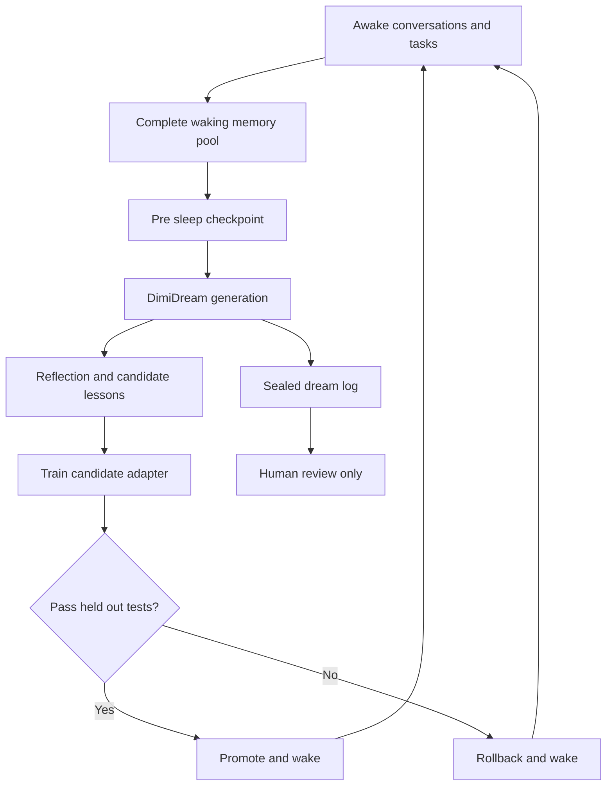

# Dreamitroth LLM

**An experimental local language model that records its waking experiences, dreams across the entire retained memory pool while asleep, and conditionally carries what it learns into the next day.**

> **Project status:** Concept and early design. There is no working release yet. This repository will document the build from the first local chat prototype through the first measurable overnight adaptation.

## The question behind the project

What would happen if a language model had something resembling a sleep cycle?

My original idea was to let a model save its current state, spend several hours generating and exploring its own internal material, modify itself from that process, and then wake up as the starting point for the next cycle. If that continued night after night, would it develop a recognizable trajectory? Could its dreams produce useful learning, unexpected associations, or something stranger?

I call the overall project **Dreamitroth LLM**. Its sleep process is called **DimiDream**.

The first goal is concrete and testable: build a small local model that changes across repeated awake and sleep cycles without destroying its existing abilities. The larger question is deliberately open: could a continuous lineage of private dreams, accumulated change, memory, goals, and waking behavior develop into something meaningfully mind-like? I do not want to decide the answer before building the experiment.

> **Core rule: Dreamitroth cannot remember its dreams as text.** Dream logs are sealed research records for human review. They are excluded from its waking context, memory search, and all later sleep cycles. If a candidate adapter is promoted, only the changes produced by the dream persist.

## Core idea

Dreamitroth keeps the original model frozen. During the day, it stores its complete retained interaction history: conversations, answers, mistakes, corrections, outcomes, uncertainty, and source material. During DimiDream, every waking memory is eligible to reappear in a dream and interact with other memories.

A sleep scheduler automatically moves through the full memory pool in manageable batches. A small trainable adapter is updated from the lessons produced by those dream cycles. The candidate adapter must then outperform the previous version on tests it was not allowed to see. If it passes, Dreamitroth wakes with the new adapter. If it fails, the system rolls back and records what happened.

The dream transcript is never placed into Dreamitroth's waking prompt or searchable memory. The awake model may behave differently because its adapter changed, but it cannot retrieve, quote, or summarize what happened during the dream. This creates an important experiment: can a dream leave a behavioral trace when the model has no textual memory of the dream itself?

Each night produces:

- A sealed, human readable dream journal that the model cannot access later
- A candidate model adapter
- An evaluation report
- A promotion or rollback decision
- A checkpoint that can be inspected later

## Proposed architecture



The system has six main parts:

| Component | Purpose | Persists across nights |
| --- | --- | --- |
| Frozen base model | General language ability | Yes |
| Memory store | Retained waking interactions, mistakes, corrections, sources, and outcomes | Yes |
| Ephemeral dream stream | Internal scenes and associations during the current sleep session | No |
| Sealed dream journal | Research record available to human observers | Stored externally; never readable by the model |
| LoRA adapter | Small trainable change to model behavior | When promoted |
| Evaluator | Fixed tests and promotion rules | Yes, kept separate |

## The DimiDream cycle

### 1. Awake

Dreamitroth chats, completes tasks, and archives the full waking interaction history. Every retained turn becomes an addressable memory record. Records may include:

- Its original response
- Whether that response was correct, uncertain, or later contradicted
- My correction and the source supporting it
- A task with a known outcome
- A preference expressed during conversation
- A question it could not answer
- A surprising connection worth revisiting
- Source material with clear provenance

Memories are labeled by source, confidence, outcome, and whether they were verified. An incorrect answer is never erased when corrected. The system keeps the failed attempt and links it directly to the correction, giving the dream process both the path that failed and the information that repaired it.

### Every memory enters the dream pool

I should not have to manually decide which memories Dreamitroth is allowed to dream about. Every retained waking memory is eligible during every sleep period.

That does not mean the entire database must fit into one prompt. A context window is finite, and the memory archive will grow continuously. The sleep scheduler therefore works through the archive in batches while maintaining a coverage ledger for each memory:

- When it was last revisited
- How many times it has appeared in sleep
- Whether it contains a correction or unresolved contradiction
- Its uncertainty and verification status
- Which other memories it has already been associated with
- Whether previous dreams involving it produced a promoted change

When the archive is small, a sleep session may process every memory. As it grows, the scheduler guarantees coverage across multiple nights while adding enough randomness for distant memories to collide unexpectedly. Corrections, contradictions, unresolved questions, and under-rehearsed memories receive higher priority without making the rest of the archive inaccessible.

Wrong answers are especially valuable dream material when they remain correctly labeled. The dream can replay the failed reasoning, introduce the correction, generate nearby cases, and test where the corrected rule stops applying. Adapter training treats the correction as the desired outcome and the original mistake as a rejected path rather than teaching both as equally valid.

### 2. Wind down

At a chosen time, Dreamitroth:

1. Closes the current awake session.
2. Saves the active adapter.
3. Freezes a snapshot of the complete waking memory archive.
4. Builds an automatic replay queue using coverage, corrections, uncertainty, recency, and randomness.
5. Creates a pre sleep checkpoint.

### 3. Dream

The model can retrieve from any retained waking memory as it generates and recombines scenes. A dream might contain:

- A corrected answer asked in a completely different way
- A situation where one important assumption changes
- An imaginary debate that challenges its certainty
- An analogy between unrelated experiences
- A fictional continuation of an unresolved idea
- A deliberately strange association intended to produce novelty

Dreams are saved as readable text for human inspection. The dream files are kept outside the model's retrievable memory and excluded from future prompts, retrieval indexes, and sleep inputs. Fiction remains labeled as fiction and cannot silently become factual memory.

### 4. Reflect

Dreamitroth reviews the dream against real corrections, trusted source material, and its current goals. It extracts candidate lessons with a reason and confidence score.

An imagined scene can influence creativity or style. It must be verified before it can teach the model a factual claim.

### 5. Adapt

A short training run updates a copy of the current LoRA adapter. The base model remains frozen, and the last working adapter remains recoverable.

This keeps each night's change relatively small, cheap to store, and easy to reverse.

### 6. Test and wake

The old adapter and candidate adapter answer the same held out prompts with the same generation settings. The candidate wakes only if it improves the target behavior while staying inside regression limits.

The system records the result even when the candidate fails. A rejected dream may still be useful for understanding how the model is changing.

When Dreamitroth wakes, the sleep context is destroyed. A promoted adapter may alter its associations, style, preferences, or problem solving, but the awake model receives no description of the dream that caused those changes.

## Future feature: "actual Dreaming"

The first prototype will use a scripted batch process: select memories, generate several dream scenes, extract candidate lessons, train an adapter, and evaluate it. That is enough to test the architecture on my current laptop.

The future version I ultimately want to build is **actual Dreaming**: a long running, isolated process in which the model generates a continuous internal experience without a person supplying each new prompt. One generated state would lead into the next for minutes or hours, allowing themes to mutate, collide, disappear, and reappear during the same sleep session.

This would require compatible hardware capable of longer contexts, sustained generation, repeated evaluation, and adapter training during one sleep period. The exact model size and hardware target will be determined through testing.

### Proposed sleep stages

An advanced sleep session may alternate between several modes:

1. **NREM style consolidation:** replay batches from the complete waking archive, compress redundant memories, identify corrections, and strengthen useful patterns.
2. **REM style association:** loosen the connection to literal replay and generate stranger analogies, counterfactuals, debates, fictional scenes, and distant connections.
3. **Reflection:** inspect the current dream stream for candidate lessons, unresolved conflicts, and proposed experiments.
4. **Adaptation:** train a temporary adapter from approved material and measure the change.
5. **Reentry:** use the altered temporary model to continue dreaming, allowing several dream and adaptation cycles within one night.

The full process would begin from an awake checkpoint and end with a candidate sleep checkpoint. Promotion tests would still happen before the candidate is allowed to become the next waking version.

### Dream amnesia

Actual Dreaming depends on a strict one way boundary:

- The dream process can query the complete retained waking memory pool.
- It can access its own evolving context only during that sleep session.
- Raw dream text is written to a separate research log as the process runs.
- When sleep ends, the model's access to that context ends permanently.
- The dream log is never indexed as memory, injected into a later prompt, or supplied to a future dream.
- The waking memory archive continues into the next cycle, and only promoted parameter changes emerge from sleep. Dream text does not cross the boundary.

The log lets human observers study what happened without giving Dreamitroth autobiographical recall of it. The awake model could be tested for indirect traces: new associations, changed preferences, shifts in problem solving, recurring themes, or personality drift. It should still be unable to answer questions such as *What did you dream about?* from stored text.

### Later experiments enabled by stronger hardware

- Run several NREM and REM style cycles in a single night
- Let the model choose temporary dream themes from its current goals
- Let it propose goal changes for later human approval
- Maintain a continuous checkpoint lineage from Model 0 to Model 1 to Model 2 and beyond
- Build a checkpoint genealogy showing which dreams produced each accepted change
- Measure identity, personality, preferences, and capabilities across that lineage
- Compare actual Dreaming with memory replay, ordinary fine tuning, and no sleep adaptation
- Test whether useful effects survive when every raw dream log remains inaccessible

## What does it mean for the model to have desires?

The phrase *its own desires* needs a testable software definition.

Dreamitroth will begin with a persistent goal file containing priorities such as:

- Improve accuracy
- Admit uncertainty when evidence is missing
- Make useful novel connections
- Preserve waking experiences with their sources, outcomes, and correction history
- Revisit unresolved questions

During sleep, it may propose a dream theme, an experiment, or a revision to one of those goals. The proposal is written to the sealed research journal for human review. Dreamitroth cannot retrieve that proposal after waking. A human can separately approve it and update the goal file for a later cycle. Changes to the evaluator or promotion rules also require human approval so the experiment remains understandable.

This still gives the model room to develop a trajectory. It can choose what to explore inside a visible system whose changes can be audited.

## A concrete example night

Imagine that Dreamitroth gives a confident but incorrect technical answer during the day. I correct it and attach a reliable explanation.

That night, DimiDream generates three related scenes:

1. The same question phrased differently
2. A version where a key assumption changes
3. A fictional conversation where somebody challenges its certainty

Dreamitroth extracts a candidate lesson: **state the assumption and ask for clarification when it is missing**.

The corrected real example and verified variations may enter adapter training. The fictional conversation stays in the sealed dream journal, which Dreamitroth cannot read after waking. The morning evaluation uses similar questions that were never shown during dreaming or training.

## Measuring whether it actually learns

A compelling dream journal is interesting, but it does not show that the model learned anything.

The first experiments will focus on one narrow behavior at a time. Each experiment will use a private set of roughly 20 to 30 held out prompts that the dream generator and trainer cannot access.

Before Night 1, the base setup answers every test prompt. After each sleep cycle, the previous and candidate adapters answer the same prompts under identical settings. New surprise prompts can be added to check whether the system learned a pattern or merely memorized examples.

Initial measures will include:

- Correct or useful answers
- Unsupported claims
- Appropriate expressions of uncertainty
- Recall of approved preferences
- General response quality
- Regressions on unrelated tasks

A nightly report will store the adapter versions, training examples, random seed, settings, scores, promotion decision, and my own observations.

## Hardware target

The first prototype is being designed around my current laptop:

- Intel Core i5 10300H
- NVIDIA GTX 1650 Ti Mobile with approximately 4 GB of VRAM
- 24 GB of system RAM

That constraint is part of the experiment. The initial model will likely be an instruction tuned model around 0.5 billion parameters, loaded in a compact format. Exact model and training choices will be tested against real memory use and speed.

The memory system and scripted dream journal can work before local adapter training works. If training proves impractical on 4 GB of VRAM, later experiments may use CPU offload or temporarily rented compute, then return the small adapter to the laptop for inference. Continuous actual Dreaming, repeated within night adaptation, and larger model experiments will wait for compatible hardware.

## Planned repository structure

```text
dreamitroth-llm/
├── README.md
├── config/
│   ├── model.json
│   └── goals.json
├── data/
│   ├── waking_archive.jsonl
│   └── memory.sqlite
├── research_logs/
│   └── dreams/
│       └── night_0001.md
├── adapters/
│   └── night_0001/
├── reports/
│   └── night_0001.json
├── tests/
│   └── held_out.jsonl
└── src/
    ├── awake.py
    ├── dream.py
    ├── reflect.py
    ├── train.py
    └── evaluate.py
```

The model facing application will have no read path from `research_logs/dreams/`. That directory exists for human observation only. This structure is provisional and will change as the prototype becomes real.

## Roadmap

### Phase 1: Memory and dreams

- [ ] Choose a small local base model
- [ ] Build a basic local chat interface
- [ ] Archive the complete retained waking interaction history
- [ ] Build a structured index over the full memory pool
- [ ] Link each incorrect answer to its correction and supporting source
- [ ] Add an automatic coverage scheduler so every memory remains dream eligible
- [ ] Add a manual **Sleep** command
- [ ] Generate and save the first dream journal
- [ ] Enforce the one way boundary between sealed dream logs and waking memory
- [ ] Verify that neither waking nor future sleeping instances can retrieve old dream text

### Phase 2: Evaluation

- [ ] Create the first held out test set
- [ ] Save a baseline from the unchanged model
- [ ] Build automatic old versus candidate comparisons
- [ ] Generate a readable nightly report
- [ ] Add human promotion and rollback controls

### Phase 3: Adaptation

- [ ] Train the first small LoRA adapter
- [ ] Save a candidate adapter for each night
- [ ] Promote only candidates that pass evaluation
- [ ] Track behavior across repeated sleep cycles
- [ ] Test whether gains transfer to new prompts

### Phase 4: Longer experiments

- [ ] Run a controlled multi night experiment
- [ ] Compare dreaming against ordinary fine tuning
- [ ] Compare verified examples with mixed real and synthetic examples
- [ ] Track checkpoint genealogy and personality drift

### Phase 5: Actual Dreaming on compatible hardware

- [ ] Test a larger model with enough context for a continuous dream stream
- [ ] Alternate NREM style consolidation with REM style associative generation
- [ ] Run several dream, reflection, and adaptation cycles per sleep session
- [ ] Allow temporary self selected dream themes
- [ ] Compare dream induced changes with replay and ordinary fine tuning controls
- [ ] Test for indirect dream effects while keeping every dream transcript inaccessible

## Known failure modes

This project could fail in several informative ways:

- **Self reinforcement:** the model may train on its own mistakes and become more confident in them.
- **Model collapse:** repeated synthetic training may reduce variety or lose rare knowledge.
- **Catastrophic forgetting:** a new adapter may improve one behavior while damaging another.
- **Evaluator gaming:** the system may learn patterns in a fixed test instead of the intended skill.
- **False memory:** dream generated content may influence the adapter as though it were a real event.
- **Correction inversion:** a mislabeled pair may teach the original mistake instead of the correction.
- **Memory saturation:** a growing archive may overwhelm the nightly compute budget and delay full coverage.
- **Personality drift:** repeated updates may make the model less coherent or useful.
- **Performance limits:** local training may be too slow or memory intensive on the target laptop.

The project addresses these risks with frozen base weights, full archive coverage tracking, linked mistake and correction records, strict provenance labels, held out tests, small adapters, checkpoints, rollback, human review, and a hard access boundary around every dream transcript.

## Why keep the base model frozen?

Low Rank Adaptation, or LoRA, adds a relatively small set of trainable parameters while leaving the pretrained model unchanged. This makes nightly versions easier to train, compare, store, and reverse. It also lets every experiment return to the same original foundation.

The adapter is the part that evolves. The base is the control.

## Following the project

I am learning the coding side as I build this, so the repository will include the reasoning, mistakes, rejected approaches, hardware limits, sealed dream journals, and evaluation results alongside the code. Publishing a journal for people to inspect does not make it available to Dreamitroth; the model's runtime will have no retrieval path to those files.

If you want to follow along:

- Watch the repository for new experiments
- Open an issue with a relevant paper, implementation idea, or failure case
- Suggest held out evaluations that are difficult to game
- Reproduce a completed experiment on different hardware
- Compare results using another small model

Early contributions will be most useful when they help make the experiment measurable and reproducible.

## The question I am leaving open

If it works, Dreamitroth may demonstrate persistent memory, private dream narratives, cumulative behavioral adaptation, self proposed goals, and a recognizable identity across repeated sleep cycles.

The more interesting question is what could emerge from that combination over time. Would it remain a sequence of useful model updates? Could the continuous lineage produce stable preferences, a self model, recurring internal themes, or something resembling a primitive inner life? Could an experience shape the waking system even though the system can never retrieve the experience itself?

I am not assuming consciousness is present, and I am not ruling it out before the experiment exists. Dreamitroth is a way to build some of the conditions that make the question interesting and then observe what develops. The measurements, checkpoints, controls, and sealed logs are there so that unexpected results can be examined seriously.

> **Let the dreamer dream, then see what wakes up.**

## References

- [Hugging Face PEFT documentation](https://huggingface.co/docs/transformers/peft)
- [Hugging Face LoRA methods](https://huggingface.co/docs/peft/main/task_guides/lora_based_methods)
- [Hugging Face bitsandbytes quantization guide](https://huggingface.co/docs/transformers/main/quantization/bitsandbytes)
- [Gerstgrasser et al. — Is Model Collapse Inevitable?](https://arxiv.org/abs/2404.01413)

## Author

Dreamitroth LLM is an independent experiment conceived by **Dimitroth**.
